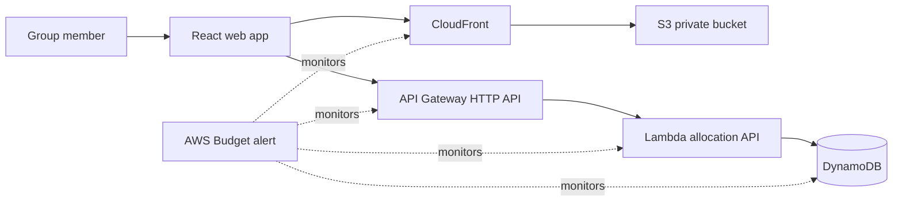

# Park and Ride to Work

A deliberately lean AWS serverless application that turns a growing shared commute into a fair, visible weekly driving rota.

> **Live app:** https://d3p55c7crmzd3p.cloudfront.net/  

## The problem

This project came from a real commute. Around 5–10 colleagues live near one another and travel approximately 38 miles to the same workplace. Most work four days each week, but their rotas vary. Rather than every person driving separately having 5 to 6 persons driving to work daily, the group meets at an agreed park-and-ride point and travels together in one or more cars.

At first, a WhatsApp group was enough to collect weekly availability and decide who would drive. As the group grew, that manual process became difficult:

- Someone had to ask for each person's next-week schedule every Sunday.
- The organiser had to count who was working on every day and calculate how many cars were needed.
- Fairness was hard to verify: a colleague who drove twice last week should not automatically drive twice again this week.
- Previous allocations lived in old WhatsApp messages, making the decision process slow and hard to explain.
- At the meeting point, the group had to search the chat again to check the expected travellers and see whether anyone was missing.

The result was avoidable admin, delayed departures, and uncertainty about whether driving had been shared fairly.

## The solution

**Park and Ride to Work** gives the group one web page where every member can submit their working days, see who has submitted, and view a generated weekly rota.

The application:

1. Keeps a pre-populated roster of the group and each vehicle's passenger-seat capacity.
2. Lets each member select their name, enter a personal PIN, select the days they are working, and state whether they can drive that week.
3. Shows the organiser which schedules are still outstanding.
4. Generates a daily rota using the last four weeks of driving history.
5. Displays the assigned driver(s), expected travellers, seat capacity, and any capacity or driver warning for each day.
6. Preserves each generated rota, so every future allocation can be checked against real history instead of chat messages.

The rota can be screen-grabbed and shared in WhatsApp. WhatsApp remains the group's familiar reminder and communication channel; the app focuses on the part that chats are poor at: reliable records and fair allocation.

## First-principles design

The project starts with the minimum facts required to solve the problem:

| Need | Minimum information required | Deliberate simplification |
| --- | --- | --- |
| Know who travels each day | Member, week, working days | No shift times, addresses, or phone numbers |
| Know who can drive | Weekly driving availability and vehicle seats | A temporary reason can be recorded for car faults or exceptional circumstances |
| Share driving fairly | Stored driver assignments | Compare the previous four weeks, not an unmanageable chat history |
| Know whether enough cars exist | Attendee count and seats per available vehicle | The app raises a warning rather than hiding a shortfall |
| Stop accidental edits | Name plus personal PIN | No full user-registration or password-reset system in version one |
| Share the result | A readable web rota | Use existing WhatsApp rather than building notifications or messaging integrations |

This avoids building services that do not directly improve the weekly decision: no social features, route optimisation, payments, live location, email service, or WhatsApp API integration.

## Fair-driver allocation

For every day from Monday to Sunday, the allocation engine:

1. Finds members who said they are working that day.
2. Limits driver candidates to those attendees who marked themselves available to drive.
3. Ranks eligible candidates by:
   1. fewest assigned driving days in the previous four weeks;
   2. then fewest assignments already made in the rota currently being generated;
   3. then the longest time since their last recorded drive;
   4. then name, only as a deterministic final tie-breaker.
4. Assigns drivers in that order until their combined vehicle capacity can carry the expected attendees.
5. Produces an explicit warning when no driver is available or there are too few seats.

All active group members are expected to drive when eligible. A person is excluded only when they have declared themselves unable to drive for that week, such as because of a faulty car or an unavoidable circumstance. The system does not punish them for this: it simply uses the available drivers and retains the record for transparency.

## Architecture



### AWS services

- **Amazon S3** stores the compiled React application.
- **Amazon CloudFront** serves the site over HTTPS; the S3 bucket is not public and accepts reads only from CloudFront.
- **Amazon API Gateway HTTP API** exposes the small REST API and applies low request throttling.
- **AWS Lambda** runs the schedule submission, PIN verification, and rota-generation logic. It uses Node.js, TypeScript, ARM64, 128 MB memory, and a 10-second timeout.
- **Amazon DynamoDB** stores members, weekly availability, and weekly rota entries using on-demand capacity.
- **Amazon CloudWatch Logs** retains Lambda logs for seven days only.
- **AWS Budgets** can send an alert when monthly spend reaches 80% of a configurable $3 limit.

Infrastructure is defined with Terraform

## Data model

| Table | Key | What it stores |
| --- | --- | --- |
| `members` | `memberId` | Display name, active status, admin flag, passenger-seat capacity, and salted PIN hash |
| `weekly-availability` | `weekStart`, `memberId` | Working days, driving availability, optional reason, and submission time |
| `weekly-rotas` | `weekStart`, `day` | Expected attendees, assigned drivers, total seats, warnings, and generation time |

Only the information needed for the rota is stored. The application intentionally does not collect home addresses, phone numbers, route data, or precise meeting-point details.

## Authentication and privacy trade-off

The application intentionally does **not** use Amazon Cognito in version one. The group is small and fixed, so members are seeded by the organiser instead of registering themselves.

Selecting a name alone would allow accidental or unauthorised edits. Each member therefore has a 4–6 digit PIN. PINs are converted into salted `scrypt` hashes before storage, and only the hash is saved in DynamoDB. A member needs the matching PIN to submit or replace their own weekly schedule. An administrator's PIN is required to generate a rota.

This is a proportionate control for a small, trusted group and low-sensitivity data—not a replacement for a full authentication service in a public multi-tenant application.

## Cost-conscious decisions

This is a personal portfolio project, so predictable low cost matters as much as functionality.

- Use serverless services that incur costs only when the small group uses them.
- Use DynamoDB `PAY_PER_REQUEST`, avoiding permanently provisioned database capacity.
- Use one small ARM64 Lambda rather than multiple services or always-on compute.
- Use an HTTP API rather than a more feature-heavy API design.
- Keep CloudWatch log retention to seven days.
- Add API Gateway throttling to help limit accidental or abusive request volume.
- Do not add Cognito, email, scheduled jobs, a custom domain, route APIs, or WhatsApp integration until they create clear value.
- Configure the optional AWS Budget alert before public deployment.

For a group of this size and usage pattern, the architecture is intended to be very low cost; AWS billing and Free Tier eligibility depend on the account, Region, and current AWS pricing. The budget alert is a guardrail, not a spending cap.

## Current functionality

- Member list loaded from DynamoDB
- Personal PIN-protected weekly schedule submission
- Availability dashboard showing submitted and outstanding schedules
- Daily attendee counts and names
- Administrator-only rota generation
- Four-week fair-driver allocation history
- Multi-car allocation based on combined passenger-seat capacity
- Clear warnings for unavailable drivers or insufficient seats
- Readable weekly rota suitable for sharing in WhatsApp

## Local prerequisites

- Node.js 22+
- Terraform 1.15+
- AWS CLI credentials configured for `eu-west-1`

## Deploy

```bash
cd frontend
npm install
npm run build

cd ../backend
npm install
npm run build

cd ../infrastructure
cp terraform.tfvars.example terraform.tfvars
terraform init
terraform plan
terraform apply
```

The first apply creates the API and uploads the initial frontend build. Configure the frontend with that API URL, rebuild it, and apply again to upload the configured assets:

```bash
cd ../frontend
VITE_API_URL="$(cd ../infrastructure && terraform output -raw api_url)" npm run build

cd ../infrastructure
terraform apply
terraform output -raw website_url
```

## Seed the group roster

Copy `backend/scripts/members.example.json` to `backend/scripts/members.json`, replace the placeholder values, then run:

```bash
cd backend
MEMBERS_TABLE=$(cd ../infrastructure && terraform output -raw members_table_name) \
  npm run seed:members -- --file scripts/members.json
```

`members.json` is ignored by Git. Never commit real member names, PINs, or other personal data.

